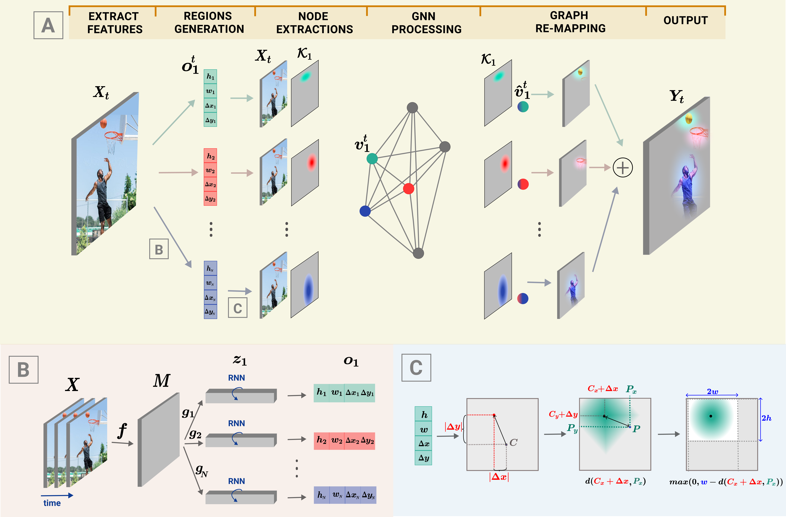

# Discovering Dynamic Salient Regions with Spatio-Temporal Graph Neural Networks
 This is the official code for DyReg model inroduced in [Discovering Dynamic Salient Regions with Spatio-Temporal Graph Neural Networks](https://arxiv.org/abs/2009.08427)

<div align="center">
  
</div>

## Citation
Please use the following BibTeX to cite our work.
```
@incollection{duta2021dynamic_dyreg_gnn_neurips2021,
title = {Discovering Dynamic Salient Regions with Spatio-Temporal Graph
Neural Networks},
author = {Duta, Iulia and Nicolicioiu, Andrei and Leordeanu, Marius},
booktitle = {Advances in Neural Information Processing Systems 34},
year = {2021}
}

@article{duta2020dynamic_dyreg,
title = {Dynamic Regions Graph Neural Networks for Spatio-Temporal Reasoning},
author = {Duta, Iulia and Nicolicioiu, Andrei and Leordeanu, Marius},
journal = {NeurIPS 2020 Workshop on Object Representations for Learning and Reasoning},
year = {2020},
}
```

## Requirements

The code was developed using:

	- python 3.7
	- matplotlib
	- torch 1.7.1
	- script
	- pandas
	- torchvision
	- moviepy
	- ffmpeg


## Overview:
The repository contains the Pytorch implementation of the DyReg-GNN model. 
The model is defined and trained in the following files: 
 - [ops/dyreg.py](https://github.com/andreinicolicioiu/dyreg_clean/blob/main/ops/dyreg.py) - code for our DyReg module
 - [ops/rstg.py](https://github.com/andreinicolicioiu/dyreg_clean/blob/main/ops/rstg.py) - code for the Spatio-temporal GNN (RSTG) used to process the graph extracted using DyReg

 - [create_model.py](https://github.com/andreinicolicioiu/dyreg_clean/blob/main/create_model.py) - two examples how to integrate the DyReg-GNN module inside an existing backbone
 - [main_standard.py](https://github.com/andreinicolicioiu/dyreg_clean/blob/main/main_standard.py) - code to train a model on Smt-Smt dataset
 - [test_models.py](https://github.com/andreinicolicioiu/dyreg_clean/blob/main/test_models.py) - code for multi-clip evaluation

Scripts for preparing the data, training and testing the model:
 - [train_model.sh](https://github.com/andreinicolicioiu/dyreg_clean/blob/main/train_model.sh) - example of script to train DyReg-GNN
 - [evaluate_model.sh](https://github.com/andreinicolicioiu/dyreg_clean/blob/main/evaluate_model.sh) - example of script to evaluate on a single clip DyReg-GNN
 - [evaluate_model_multi_clip.sh](https://github.com/andreinicolicioiu/dyreg_clean/blob/main/evaluate_model_multi_clip.sh) - example of script to evaluate on multiple clips DyReg-GNN

 - [tools/](https://github.com/andreinicolicioiu/dyreg_clean/blob/main/tools) contains all the script used to prepare Smt-Smt dataset (similar to the setup used in TSM)


## Prepare dataset

For [Something Something dataset](https://arxiv.org/pdf/1706.04261v2.pdf):
* the json files  containing meta-data should be stored in `./data/smt-smt-V2/tsm_data`
* the zip files containing the videos should be stored in `./data/smt-smt-V2/` 

- - - -

1. **To extract the videos from the zip files run:**

`cat 20bn-something-something-v2-?? | tar zx`

2. **To extract the frames from videos run:**

`python tools/vid2img_sthv2.py`

→ The videos will be stored in *$FRAME_ROOT* (default `'./data/smt-smt-V2/tmp_smt-smt-V2-frames'`)

💡 *If you already have the dataset as frames, place them under `./data/smt-smt-V2/smt-smt-V2-frames/`, one folder for each video* \
💡💡 *If you need to change the path for datasets modify *$ROOT_DATASET* in [dataset_config.py](https://github.com/andreinicolicioiu/dyreg_clean/blob/main/ops/dataset_config.py)*


3. **To generate the labels file in the required format please run:**

`python tools/gen_label_sthv2.py `

→ The resulting txt files, for each split, will be stored in *$DATA_UTILS_ROOT* (default `'./data/smt-smt-V2/tsm_data/'`)


## How to run the model

DyReg-GNN module can be simply inserted into any space-time model. 
```
import torch
from torch.nn import functional as F
from ops.dyreg import DynamicGraph, dyregParams

class SpaceTimeModel(torch.nn.Module):
    def __init__(self):
        super(SpaceTimeModel, self).__init__()
        dyreg_params = dyregParams()
        dyregParams.offset_lstm_dim = 32
        self.dyreg = DynamicGraph(dyreg_params,
                    backbone_dim=32, node_dim=32, out_num_ch=32,
                    H=16, W=16, 
                    iH=16, iW=16,
                    project_i3d=False,
                    name='lalalal')


        self.fc = torch.nn.Linear(32, 10)

    def forward(self, x):
        dx = self.dyreg(x)
        # you can initialize the dyreg branch as identity function by normalisation, 
        #   as done in DynamicGraphWrapper found in ./ops/dyreg.py 
        x = x + dx
        # average over time and space: T, H, W
        x = x.mean(-1).mean(-1).mean(-2)
        x = self.fc(x)
        return x


B = 8
T = 10
C = 32
H = 16
W = 16
x = torch.ones(B,T,C,H,W)
st_model = SpaceTimeModel()
out = st_model(x)
```


For another example of how to integrate DyReg (DynamicGraph module) inside your model please look at [create_model.py](https://github.com/andreinicolicioiu/dyreg_clean/blob/main/create_model.py) or run:

`python create_model.py`


### Something-Something experiments

#### Training a model

To train a model on smt-smt v2 dataset please run

`./start_main_standard.sh model_name`

For default hyperparameters check opts.py. For example, `place_graph` flag controls how many DyReg-GNN modules to use and where to place them inside the backbone:
```
# for a model with 3 DyReg-GNN modules placed after layer 2-block 2, layer 3-block 4 and layer 4-block 1 of the backbone
--place_graph=layer2.2_layer3.4_layer4.1 
# for a model with 1 dyreg module placed after layer 3 block 4 of the backbone
--place_graph=layer3.4                   
```

#### Single clip evaluation

Train a model with the above script or download a pre-trained DyReg-GNN model from [here](https://drive.google.com/file/d/1MA_zfHSoutTVL6X9JxyIBLkX0rNJmC_6/view?usp=sharing) and put the checkpoint in ./ckeckpoints/

To evaluate a model on smt-smt v2 dataset on a single 224 x 224 central crop, run:

`./start_main_standard_test.sh model_name`

The flag `$RESUME_CKPT` indicate the the checkpoint used for evaluation.


#### Multi clips evaluation

To evaluate a model in the multi-clips setup (3 spatials clips x 2 temporal samplings) on Smt-Smt v2 dataset please run

`./evaluate_model.sh model_name`

The flag `$RESUME_CKPT` indicate the the checkpoint used for evaluation.

### TSM Baseline
This repository adds DyReg-GNN modules to a TSM backbone based on code from [here](https://github.com/mit-han-lab/temporal-shift-module).
